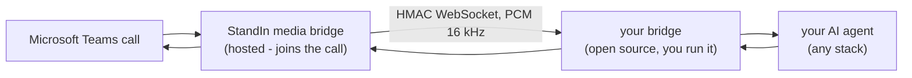

# StandIn

### Your AI teammate in Microsoft Teams calls

Put your own AI agent into a Microsoft Teams call as a real teammate, in your own tenant. It answers and places calls, sees the caller's camera and screen-share, converses in real time, and appears as a lip-synced avatar. Free sandbox, no Azure bot, no card.

[**Try it - standin.komaa.com**](https://standin.komaa.com) &nbsp;·&nbsp; [**Documentation**](https://docs.komaa.com) &nbsp;·&nbsp; [**Quickstart**](https://docs.komaa.com/quickstart)

---

## Bring your own agent

**StandIn** is the hosted media bridge that joins the Teams call and handles all the media and avatar rendering. You bring the brain. A small open-source bridge connects your existing AI agent, whatever stack it runs on, so it answers Teams calls with no Teams SDK, no Microsoft Graph, and no media infrastructure to run.

Seven backends, published on npm and PyPI:

| Backend | What it connects | Package |
|---|---|---|
| **OpenClaw** | The OpenClaw framework, as a plugin |  |
| **Hermes** | The Hermes Agent, as a plugin |  |
| **ElevenLabs** | A hosted ElevenLabs Agent |   |
| **LiveKit** | Any LiveKit Agent, including avatar agents |   |
| **OpenAI** | OpenAI Realtime (`gpt-realtime`) |  |
| **Deepgram** | A Deepgram Voice Agent |   |
| **Cartesia** | A Cartesia Line voice agent |  |

Each backend has its own docs site with a getting-started guide, configuration reference, and a runnable example. Start at **[docs.komaa.com](https://docs.komaa.com)**.

## How it works

The hosted bridge owns the hard part - joining the meeting, capturing media, rendering the avatar. Your bridge is a small, dependency-light service that terminates an HMAC-authenticated WebSocket on one side and your agent platform on the other. Audio is 16 kHz PCM; the transport is replay-proof and recording-gated.

## The three CVI pillars

A Teams call becomes a true two-way video conversation:

- **Perception** - the agent sees the caller's camera and screen-share, on demand or continuously.
- **Dialogue** - realtime speech-to-speech or streaming STT to agent to TTS, with barge-in and group-call etiquette.
- **Rendering** - a lip-synced animated avatar tile, with expression cues and picture-in-picture image sharing.

## Get started

1. Pick a tier at **[standin.komaa.com](https://standin.komaa.com)** - the free sandbox needs no Azure bot and no card.
2. Choose the backend that matches your stack from the table above.
3. Follow its guide on **[docs.komaa.com](https://docs.komaa.com)**, point your StandIn identity at the bridge, and place a call.

## About

Every bridge is open source, security-reviewed, and published under a permissive MIT license.

[Website](https://standin.komaa.com) &nbsp;·&nbsp; [Docs](https://docs.komaa.com) &nbsp;·&nbsp; [Company](https://komaa.com)

